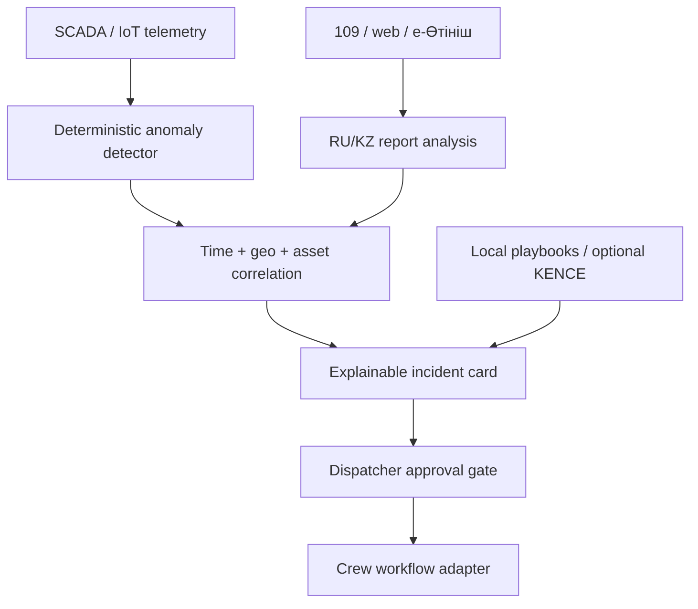

# Architecture and trust boundaries

## Data flow

## Components

| Component | Responsibility | Failure behaviour |
|---|---|---|
| Telemetry anomaly detector | Median/MAD baseline and deviation score | No LLM dependency; insufficient history returns no anomaly |
| Report analyser | Language, incident type, urgency and summary | Deterministic RU/KZ rules remain available when Ollama is off |
| Correlator | Time, distance, compatible asset and evidence merging | Unmatched reports enter the manual-link timeline |
| Risk engine | Explicit weighted score and severity threshold | Inputs remain visible in evidence metadata |
| Playbook retrieval | Local lexical retrieval and cited actions | Bundled demo sections remain available offline |
| Callcentrai adapter | Optional local speech-to-text boundary | Returns 503/502; text ingestion still works |
| KENCE adapter | Optional question to a pre-authorised document session | Returns 503/502; local playbooks still work |
| Dispatcher UI | Map, telemetry, evidence, recommendation and approval | Read-only until an explicit operator action |

## Decision boundary

Deterministic code owns sensor anomaly detection, correlation thresholds, risk
scoring and state transitions. An LLM may enrich report interpretation or
explain procedures, but cannot create a machine anomaly, change incident status,
assign a crew or act on industrial equipment.

## MVP storage

The demonstration uses a thread-safe in-memory repository so the scenario is
repeatable. For a real pilot, replace the repository behind the service boundary
with PostgreSQL/PostGIS and add an immutable decision audit. The domain and API
contracts do not require the UI to change.

## Security boundaries

- Services run as non-root users in read-only containers.
- The API binds to loopback in the default Compose file.
- Audio is limited to 20 MB and only sent to a configured Callcentrai endpoint.
- CORS is allow-listed; operational actions require a human gate in the UI.
- Tokens stay in environment variables and are never returned by health routes.
- Production requires identity/RBAC, TLS, rate limiting, audit retention,
  connector allow-lists and data retention rules before real citizen data enters.
